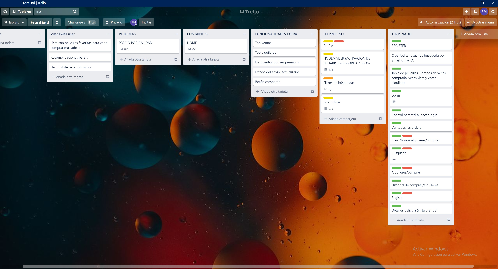
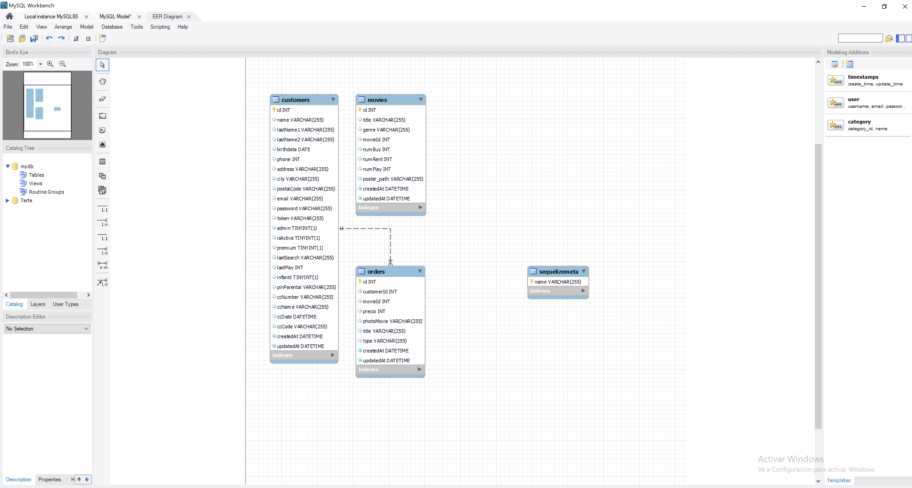
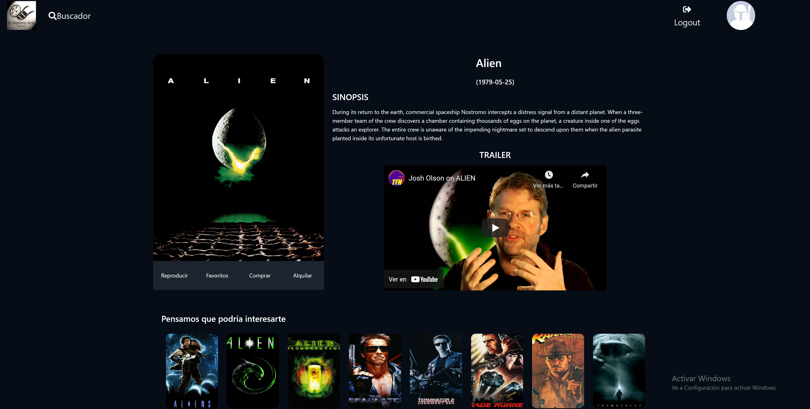

<a name="top"></a>

<h1 align="center">
  <br>Bienvenidos a "El Séptimo Arte". 
  <br>Tu App de películas.
</h1>


:speech_balloon: [About](#id1)   

:hammer: [Herramientas](#id2)

:clipboard: [Instrucciones](#id3)

:eye_speech_bubble: [Fase I - Creando el backend](#id4)

:exclamation: [Requisitos y extras](#id5)

:collision: [Proximamente](#id7)

:smile: [Thanks](#id8)

---

<a name="id1"></a>
## **Sobre el proyecto**

Realización de una aplicación que permite alquilar y comprar películas, así como adquirir una subscripción para verlas todas.

Es el 8º proyecto de la  [GeeksHubs Academy](https://bootcamp.geekshubsacademy.com/) Full Stack Developer Bootcamp. 

---
**Fecha de comienzo:** 21 / Jun /2021
**Fecha de entrega:** 05 / Jul / 2021


**Realizado por:**
* [Pedro Agulló Marco](https://github.com/PedroAgullo)

---

<a name="id2"></a>
***
## **Herramientas**
**Trello:**



**MySql Workbench:**




|  | React | 

|| Redux | 

|  | Visual Studio Code |

|  | JavaScript | 

|  | Node JS & Express |

|  | Git |

|  | GitHub | 


<a name="id3"></a>
***
## **Instrucciones**

<h3> Arrancando el proyecto </h3>
   
Es necesario realizar las siguientes instalaciones:

```javascript
npx create-react-app "name"
npm i react-router-dom
npm i --save redux
npm install --save react-redux
npm i --save redux-localstorage-simple
npm i axios
```


<a name="id4"></a>
## Fase I Creación del backend

Si quieres saber más acerca de esta fase, puedes echar un vistazo al repositorio del mismo.

<a name="id5"></a>
## Requisitos del proyecto

* Vista Home / Principal.
* Vista Login de usuarios.
* Vista registro de usuarios.
* Vista panel de alquileres/compras.
* Vista administración con todas las compras de los usuarios.


<a name="id6"></a>
## Puntos extra

**Usuario**

  * Registro del usuario y activación de la cuenta por email.
  * El usuario puede ver las películas compradas/alquiladas.
  * Búsqueda con "scroll infinito" de películas.
  * Si compras la suscripción Premium, puede tener acceso al perfil adulto o infantil, con películas para los niños.
  * En mi perfil se puede editar los datos del usuario.
  * Podemos ver los pedidos realizados y filtrarlos por compras, alquileres y subscripciones adquiridas.
  * En Mis peliculas tenemos acceso directo a las películas que hemso comprado o que el alquiler está en vigencia.
  * En configuración podemos comprar una nueva suscripción premium, actualizar el método de pago y activar el control parental.
  * Cada usuario tiene recomendaciones de películas basada en sus gustos. 
 
**Busquedas**

  * Se pueden realizar busquedas por nombre de la pelicula y por género.
  * En cualquier caso obtenemos un listado de películas que se va ampliando al realizar scroll en pantalla.
  * Al seleccionar una película tendremos la opción de comprarla, alquilarla o verla.

**Admin**

  * Busqueda de usuarios por email e ID y editar sus datos.
  * Eliminación de compras.
  * Filtro de pedidos por compras, alquileres, subscripciones premium y ver todas.
  * Estadísticas, numero de unidades vendidas por tipo de venta e ingresos por tipo de venta.





<a name="id7"></a>
***
## **Proximamente**

* Deploy con Heroku.
* Añadir nuevas estadísticas
* Añadir películas a favoritos.
* Top Ventas y Top Alquileres.
* Pago con tarjeta.
* Mejorar ciertas vistas del perfil del usuario.

<a name="id8"></a>
***
## **Thanks**

Gracias a todos mis compañeros por su ayuda en este proyecto. Y en especial a mi mujer y a mis hijos por el apoyo que me dan.

<br>
<br>

[UP](#top)
